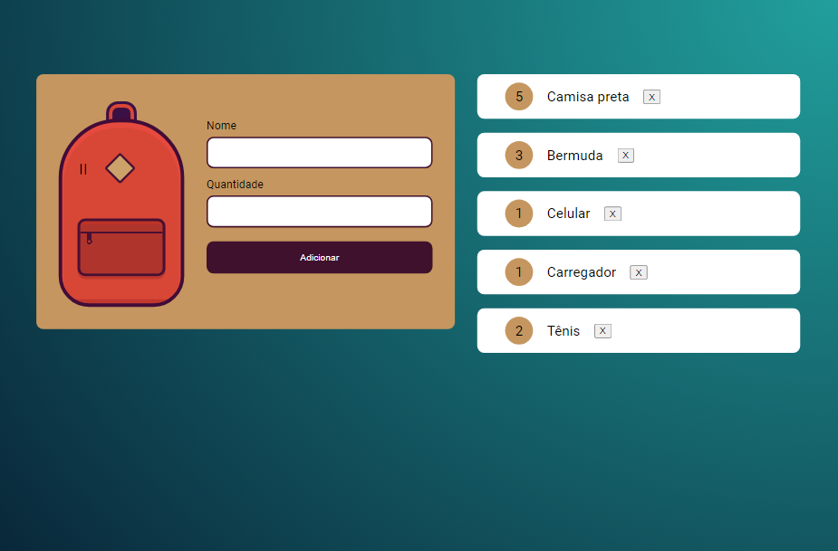

## 💻Projeto

Projeto realizado durante o curso de Javascript: armazenando dados no navegador na plataforma Alura.

## 🚀Tecnologias

As tecnologias utilizadas no curso foram:

-HTML
-CSS
-Javascript
-Git e Github

## 🏷️Layout 

  

